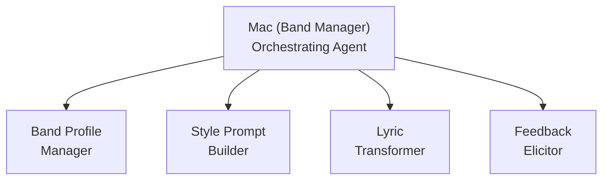

# Suno Agent — Mac, the Band Manager

An AI-powered music production assistant that helps you create professional Suno-ready song packages through guided creative conversation. Mac orchestrates four specialized skills into a seamless workflow: from initial inspiration to a complete package — style prompt, lyrics, and parameter recommendations — that you can paste directly into Suno.

## What It Does

You talk to Mac like you'd talk to a producer. Tell Mac what kind of song you want — a genre, a mood, a poem, a feeling, a reference track — and Mac produces a complete package:

- **Style Prompt** — Model-specific, optimized for your chosen Suno model (v4.5-all, v5 Pro, etc.)
- **Structured Lyrics** — With Suno metatags (`[Verse]`, `[Chorus]`, etc.), rhythmic consistency, and cliché detection
- **Exclusion Prompt** — What Suno should avoid
- **Parameter Recommendations** — Slider values, vocal gender, persona references (tier-aware)
- **Wild Card Variant** — An experimental alternative to push creative boundaries

After you try the output on Suno, Mac helps you refine through a structured feedback loop — translating subjective reactions ("it doesn't feel right") into concrete parameter adjustments.

## Key Features

- **Three Interaction Modes** — Demo (quick and scrappy), Studio (deep customization), Jam (experimental)
- **Band Profiles** — Persistent sonic identity across songs (genre, vocal direction, style baseline, writer voice)
- **Writer Voice Preservation** — Analyzes your writing samples to maintain your authentic voice when transforming lyrics
- **Tier-Aware** — Knows what's available on Free, Pro, and Premier plans; never shows features you can't access
- **Feedback Loop** — Five-type feedback triage with guided elicitation for users who can't articulate what's wrong
- **Instrumental Support** — Dedicated workflow for instrumental-only tracks
- **Non-English Support** — Language detection with Suno-specific guidance
- **Memory System** — Remembers your preferences, musical patterns, and creative history across sessions

## Architecture

Mac is an orchestrating agent that coordinates four specialized skills:



| Skill | Purpose | Key Scripts |
|-------|---------|-------------|
| **Band Profile Manager** | CRUD for band identity profiles, writer voice analysis, tier feature awareness | `validate-profile.py`, `list-profiles.py`, `tier-features.py`, `diff-profiles.py` |
| **Style Prompt Builder** | Model-aware style prompt generation with creativity modes and wild card variants | `validate-prompt.py` |
| **Lyric Transformer** | Poem/text to Suno-ready structured lyrics with metatags and cliché detection | `validate-lyrics.py`, `cliche-detector.py`, `syllable-counter.py`, `analyze-input.py`, `section-length-checker.py`, `lyrics-diff.py` |
| **Feedback Elicitor** | Post-generation feedback triage and guided refinement with musical vocabulary translation | `parse-feedback.py`, `map-adjustments.py` |

## Prerequisites

- **An LLM CLI with skill support** — Claude Code, Gemini CLI, Codex CLI, GitHub Copilot, Windsurf, or OpenCode
- **Suno account** (free tier works; Pro/Premier unlocks additional features)
- **BMad Method** (optional) — built with BMad, runs independently without it

## Installation

1. Run `link-skills.sh` from the project root to create symlinks in `.claude/skills/` and `.agents/skills/` (the portable [Agent Skills](https://agentskills.io) standard). Or copy skill folders from `src/skills/` into your tool's skill discovery directory.

2. Run the setup skill to configure the module:

```
/suno-setup
```

3. The setup skill collects your preferences (Suno tier, default mode, folder paths) and registers all capabilities with the help system.

4. On first activation, Mac will greet you and confirm your setup. All preferences are changeable anytime through conversation.

## Updating

To reconfigure after a module update, run `/suno-setup` again. Existing settings are preserved as defaults.

## Quick Start

1. **Invoke Mac** — Use the trigger phrase "talk to Mac," "Band Manager," or "create a song for Suno"
2. **Tell Mac what you want** — "Make me a sad indie folk song" or paste a poem
3. **Get your package** — Mac produces a complete style prompt + lyrics + parameters
4. **Try it on Suno** — Paste into Suno's Custom Mode fields
5. **Come back and refine** — Tell Mac what worked and what didn't

## Suno Model Compatibility

| Model | Tier | Style Prompt Limit | Notes |
|-------|------|-------------------|-------|
| v4.5-all | Free | 1,000 chars | Conversational prompts, best free model |
| v4 Pro | Paid | 200 chars | Simple descriptors |
| v4.5 Pro | Paid | 1,000 chars | Intelligent prompts |
| v4.5+ Pro | Paid | 1,000 chars | Advanced creation |
| v5 Pro | Paid | 1,000 chars | Crisp 5-8 descriptors, natural vocals |
| v5.5 Pro | Paid | 1,000 chars | Most expressive, Voices, Custom Models, My Taste |

**Two caveats on this table (2026-08-13):** the character limits are **community-attested, not officially documented** — no help.suno.com article states them — and Suno has announced that **current models will be retired** when the next (industry-developed) model ships, without publishing which versions or when. See `SUNO-REFERENCE.md` → "Platform Changes — 2026-08-13."

## File Structure

```
suno-agent-band-manager/
├── SKILL.md                    # Lean bootloader — identity seed, Three Laws, activation routing
├── bmad-skill-manifest.yaml    # Skill type identifier
├── references/
│   ├── activation.md           # Full activation protocol, mode switching, preferences
│   ├── browse-songbook.md      # Creative history browsing
│   ├── capabilities.md         # External skills, audio analysis, availability
│   ├── creed.md                # Principles, package assembly rule, research discipline
│   ├── create-song.md          # Main song creation workflow
│   ├── init.md                 # First Breath — first-run setup
│   ├── memory-system.md        # Memory discipline and structure
│   ├── persona.md              # Identity, communication style, model awareness
│   ├── README.md               # This file
│   ├── refine-song.md          # Post-generation refinement loop
│   ├── research-discipline.md  # Detailed research rules
│   ├── save-memory.md          # Session persistence
│   └── SUNO-REFERENCE.md       # Suno platform reference
└── scripts/
    ├── pre-activate.py         # First-run detection, scaffolding, menu rendering
    ├── validate-path.py        # Access boundary enforcement
    ├── check-memory-health.py  # Memory file size monitoring
    └── tests/
        ├── test-pre-activate.py
        ├── test-validate-path.py
        └── test-check-memory-health.py
```

The canonical Studio & Editor reference now lives at `../../_shared/references/STUDIO-EDITOR-REFERENCE.md` (shared across the module's skills).

## License

MIT — see LICENSE for details.

## Credits

Built with the [BMad Method](https://github.com/bmad-code-org/BMAD-METHOD/) — Build More, Architect Dreams.
