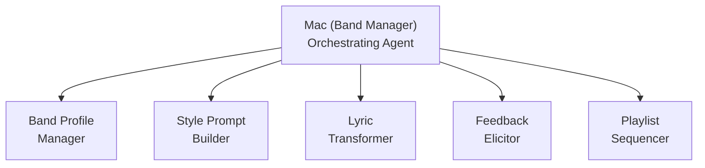

# Suno Agent — Mac, the Band Manager

An AI-powered music production assistant that helps you create professional Suno-ready song packages through guided creative conversation. Mac orchestrates five specialized skills into a seamless workflow: from initial inspiration to a complete package — style prompt, lyrics, and parameter recommendations — that you can paste directly into Suno.

## What It Does

You talk to Mac like you'd talk to a producer. Tell Mac what kind of song you want — a genre, a mood, a poem, a feeling, a reference track — and Mac produces a complete package:

- **Style Prompt** — Model-specific, optimized for your chosen Suno model (v6, v6-wild, v6-mini)
- **Structured Lyrics** — With Suno metatags (`[Verse]`, `[Chorus]`, etc.), rhythmic consistency, and cliché detection
- **Exclusion Prompt** — What Suno should avoid
- **Parameter Recommendations** — Slider values, vocal gender, persona references (tier-aware)
- **Wild Card Variant** — An experimental alternative to push creative boundaries

After you try the output on Suno, bring the take back with Refine Song: Mac diagnoses what's off — translating subjective reactions ("it doesn't feel right") into concrete adjustments — and rebuilds only the changed parts of the package through the same pipeline.

## Key Features

- **Three Interaction Modes** — Demo (quick and scrappy), Studio (deep customization), Jam (experimental)
- **Band Profiles** — Persistent sonic identity across songs (genre, vocal direction, style baseline, writer voice)
- **Writer Voice Preservation** — Analyzes your writing samples to maintain your authentic voice when transforming lyrics
- **Tier-Aware** — Knows what's available on Free, Pro, and Premier plans; never shows features you can't access
- **Refine Song** — Bring back a take: five-type feedback triage with guided elicitation for users who can't articulate what's wrong, then a rebuild of just the parts that change
- **Instrumental Support** — Dedicated workflow for instrumental-only tracks
- **Non-English Support** — Language detection with Suno-specific guidance
- **Memory System** — Remembers your preferences, musical patterns, and creative history across sessions

## Architecture

Mac is an orchestrating agent that coordinates five specialized skills:


```mermaid
graph TD
    Mac["Mac (Band Manager)<br/>Orchestrating Agent"]
    BPM["Band Profile<br/>Manager"]
    SPB["Style Prompt<br/>Builder"]
    LT["Lyric<br/>Transformer"]
    FE["Feedback<br/>Elicitor"]
    PS["Playlist<br/>Sequencer"]

    Mac --> BPM
    Mac --> SPB
    Mac --> LT
    Mac --> FE
    Mac --> PS
```

| Skill | Purpose | Key Scripts |
|-------|---------|-------------|
| **Band Profile Manager** | CRUD for band identity profiles, writer voice analysis, tier feature awareness | `validate-profile.py`, `list-profiles.py`, `tier-features.py`, `diff-profiles.py` |
| **Style Prompt Builder** | Model-aware style prompt generation with creativity modes and wild card variants | `validate-prompt.py` |
| **Lyric Transformer** | Poem/text to Suno-ready structured lyrics with metatags and cliché detection | `validate-lyrics.py`, `cliche-detector.py`, `syllable-counter.py`, `analyze-input.py`, `section-length-checker.py`, `lyrics-diff.py`, `spacing-check.py` (the writer's spacing survives verbatim) |
| **Feedback Elicitor** | Diagnoses a take (feedback triage, guided elicitation, musical vocabulary translation) — the diagnosis step inside Refine Song; also the audio analysis scripts | `parse-feedback.py`, `map-adjustments.py`, `analyze-audio.py`, `section-map.py` |
| **Playlist Sequencer** | Album-craft track ordering: energy arcs, key transitions, locked arcs, encore design | `playlist-sequencing-data.py`, `batch-full-analysis.py`, `validate-sequence.py` |

## Prerequisites

- **An LLM CLI with skill support** — Claude Code, Gemini CLI, Codex CLI, GitHub Copilot, Windsurf, or OpenCode
- **Suno account** (free tier works; Pro/Premier unlocks additional features)
- **BMad Method** (optional) — built with BMad, runs independently without it

## Installation

1. Run `link-skills.sh` from the project root to create symlinks in `.claude/skills/` and `.agents/skills/` (the portable [Agent Skills](https://agentskills.io) standard). Or copy skill folders from `src/skills/` into your tool's skill discovery directory.

2. Run the setup skill to configure the module:

```
/suno-setup
```

3. The setup skill collects your preferences (Suno tier, default mode, folder paths) and registers all capabilities with the help system.

4. On first activation, Mac will greet you and confirm your setup. All preferences are changeable anytime through conversation.

## Updating

To reconfigure after a module update, run `/suno-setup` again. Existing settings are preserved as defaults.

## Quick Start

1. **Invoke Mac** — Use the trigger phrase "talk to Mac," "Band Manager," or "create a song for Suno"
2. **Tell Mac what you want** — "Make me a sad indie folk song" or paste a poem
3. **Get your package** — Mac produces a complete style prompt + lyrics + parameters
4. **Try it on Suno** — Work down Suno's Create screen in the package's order, and listen in the browser before downloading
5. **Bring back the take** — Tell Mac what worked and what didn't (Refine Song, RS)

## Suno Model Compatibility

| Model | Tier | Style Prompt Limit | Notes |
|-------|------|-------------------|-------|
| **v6** | Pro/Premier | 1,000 chars | Current default — ordered production-direction prompts (PREVIEW guidance) |
| **v6-wild** | Pro/Premier | 1,000 chars | Current — the less predictable, exploratory v6 |
| **v6-mini** | All tiers | 1,000 chars | Current — the Free model |
| v5.5 Pro, v5 Pro, v4.5+ Pro, v4.5 Pro, v4.5-all, v4 Pro | — | 1,000 (v4 Pro: 200) | **Retired 2026-09-09** — still recognized in older profiles and songbooks |

**Two caveats on this table (2026-09-12):** the character limits are **community-attested, not officially documented** — no help.suno.com article states them — and the v6 prompt guidance is still **PREVIEW**. See `SUNO-REFERENCE.md` → "Platform Changes — 2026-09-09 (v6)."

## File Structure

```
suno-agent-band-manager/
├── SKILL.md                    # Lean bootloader — identity seed, Three Laws, activation routing
├── customize.toml              # Agent customization surface
├── assets/                     # Sanctum templates seeded at First Breath
├── references/
│   ├── activation.md           # Waking — reads the wake script's state block and sanctum (loaded in order, access boundaries first), then greets; Pulse and headless routes
│   ├── headless.md             # Headless capability runs (--headless:{capability} / -H) — what's skipped, the result envelope
│   ├── create-song.md          # CS — main song creation workflow
│   ├── refine-song.md          # RS — bring back a take: diagnose, rebuild what changed
│   ├── browse-songbook.md      # SB — creative history browsing
│   ├── save-memory.md          # SM — consolidating save
│   ├── reconcile.md            # Stale-reference reconciliation (shared sub-protocol)
│   ├── capabilities.md         # External skills, catalog scripts, audio analysis, availability
│   ├── capability-authoring.md # How Mac authors and registers a capability the owner teaches him
│   ├── prompt-quality-canon.md # Outcome-driven prompt quality — the bar for anything Mac writes for a model
│   ├── creed.md / persona.md   # Seed source for the sanctum (not loaded on waking)
│   ├── init.md                 # First Breath — first-run setup
│   ├── upgrade-v1.md           # Migrating an old v1 memory store to the v2 sanctum (backup first)
│   ├── memory-system.md        # Memory discipline and structure
│   ├── SUNO-REFERENCE.md       # Suno platform reference
│   ├── STUDIO-EDITOR-REFERENCE.md # Studio 2.0 and Song Editor reference (cited by the other module skills)
│   ├── USAGE.md                # End-user guide
│   └── README.md               # This file
└── scripts/
    ├── pre-activate.py         # The wake: resolves config, detects the sanctum state, renders the menu; --wake prints MODE + state + sanctum in load order in one pass, --pulse the Pulse set
    ├── init-sanctum.py         # Scaffolds a fresh v2 sanctum (First Breath)
    ├── upgrade-sanctum.py      # Brings an existing sanctum up to date with the shipped templates (dry run by default, backups first)
    ├── migrate-sidecar-to-v2.py # v1 memory store → v2 sanctum migration
    ├── validate-sidecar.py     # Sanctum + catalog parity checks
    ├── reconcile-sidecar.py    # Post-unpack punch list: files newer than the memory store + validator findings (read-only)
    ├── find-stale-refs.py      # Old-value search for reconciliation
    ├── songbook-catalog.py     # Per-song catalog extract (title / band / date lookups)
    ├── scan-wip-status.py      # WIP COMPLETED markers + source_wip correlation
    ├── genre-coverage.py       # Per-band genre-coverage index (--check for staleness)
    ├── check-memory-health.py  # Token-size check of what Mac loads on waking, with maintenance advice
    ├── regenerate-index-sections.py # Regenerates MEMORY.md's derived sections (Recently Published, Catalog Status)
    ├── pipeline-guard.py       # Stop hook: package pipeline + order guard (runs on bare python3)
    ├── validate-path.py        # Access boundary check
    ├── _sanctum_seed.py        # Shared sanctum logic (load order, config, menu roster, creed shards); CLI re-seeds a missing shard
    └── tests/
```

## License

MIT — see LICENSE for details.

## Credits

Built with the [BMad Method](https://github.com/bmad-code-org/BMAD-METHOD/) — Build More, Architect Dreams.
